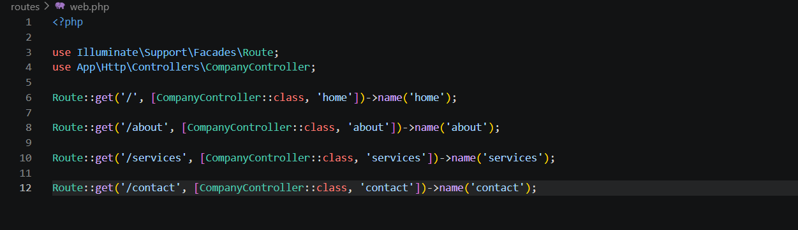
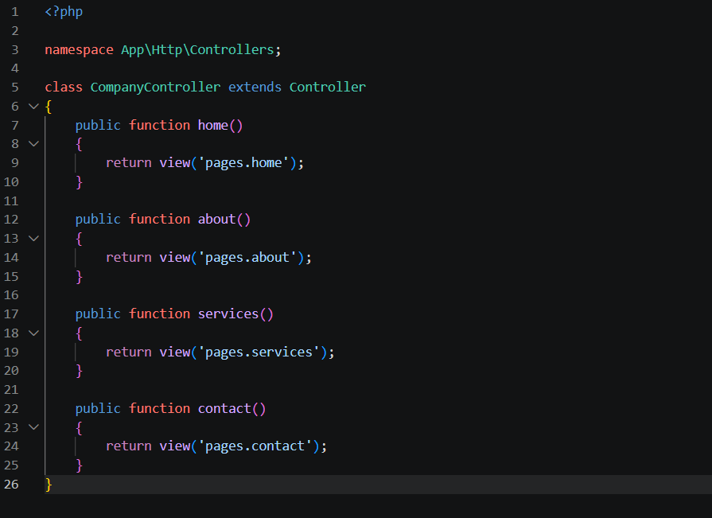
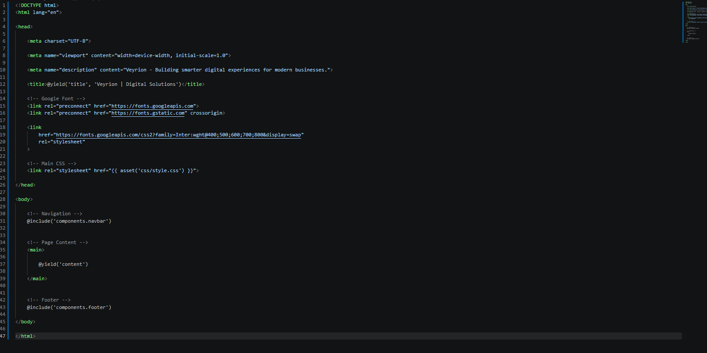
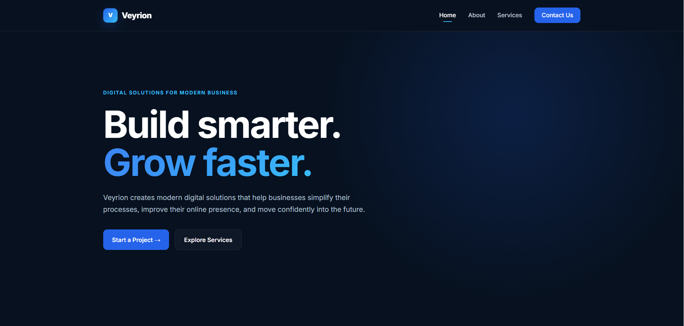
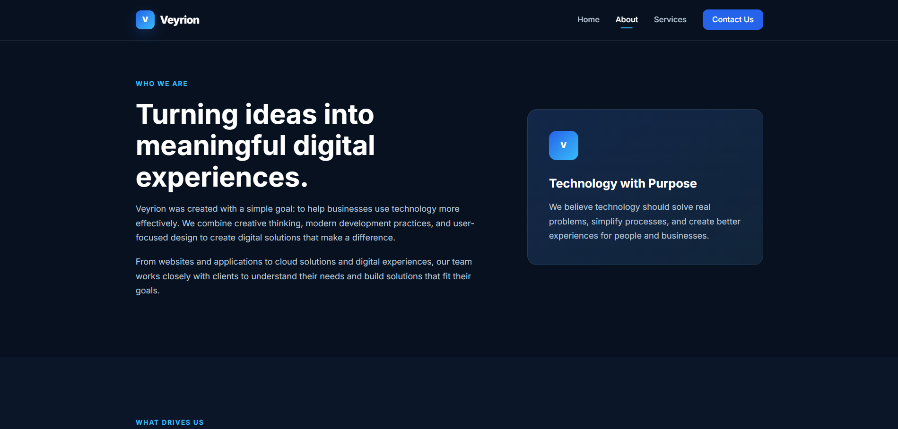
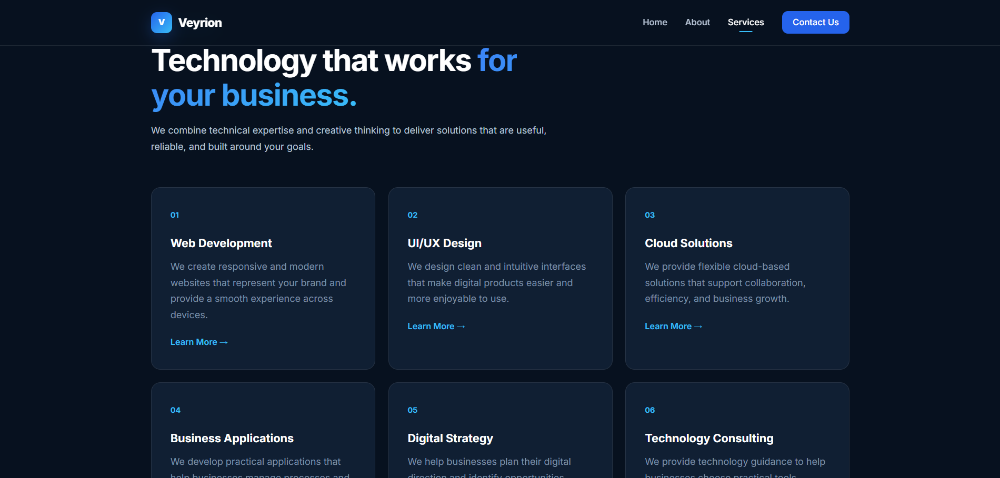
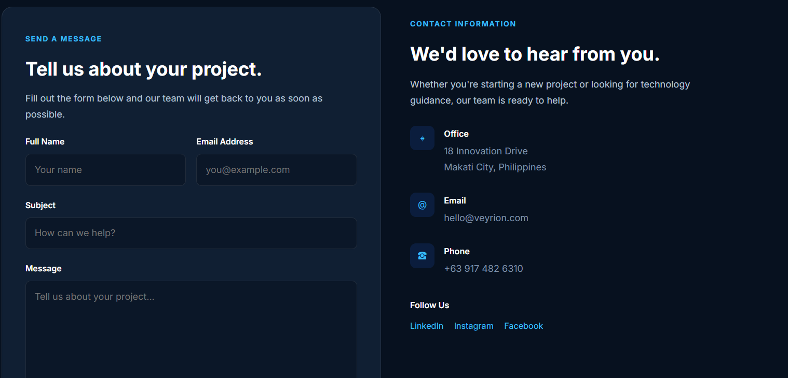
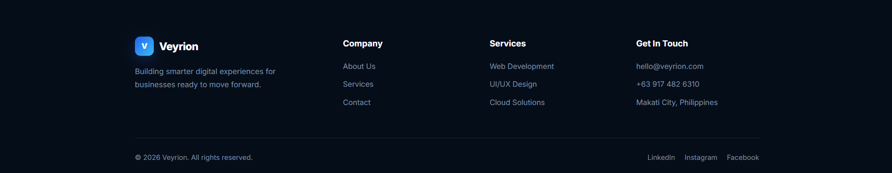

# Veyrion – Company Profile Website

## 1. Project Title

Veyrion – Company Profile Website

---

## 2. Introduction

### What is a Company Profile Website?

A Company Profile Website is a website that presents important information about a company, such as its background, mission, vision, services, and contact information. It gives visitors an overview of what the company does and what it can offer.

### Why Businesses Need One

Businesses need a company profile website because it provides an online presence where customers and potential clients can easily learn about the company. A professional website can also help build credibility, improve communication with customers, and make information about the business available online.

### Purpose of the Project

The purpose of this project is to develop a multi-page Company Profile Website using Laravel. The project demonstrates the use of Laravel's MVC architecture, routing, controllers, Blade templates, reusable components, and responsive CSS.

---

## 3. Objectives

The objectives accomplished in this project are:

- Develop a multi-page Company Profile Website using Laravel.
- Apply the Model-View-Controller (MVC) architecture.
- Create and configure Laravel routes.
- Use named routes and GET requests.
- Create a controller for handling page requests.
- Create reusable Blade layouts and components.
- Use Blade directives such as `@extends`, `@section`, `@yield`, and `@include`.
- Create Home, About, Services, and Contact pages.
- Create a responsive navigation bar and footer.
- Display at least six company services.
- Apply custom CSS styling to the website.
- Organize the project using Laravel's standard folder structure.

---

## 4. MVC Architecture

### What is MVC?

MVC stands for Model-View-Controller. It is a software architecture pattern that separates an application into three main parts: Model, View, and Controller.

The Model is responsible for handling data and database-related operations. The View is responsible for displaying information to the user. The Controller handles requests and connects the routes with the appropriate views or application logic.

### Why Laravel Uses MVC

Laravel uses the MVC architecture because it helps developers organize their applications into separate responsibilities. Instead of placing all the code in one file, Laravel separates routing, application logic, data, and presentation.

This makes Laravel applications easier to understand, develop, test, and maintain.

### Advantages of MVC

Some advantages of MVC include:

- Separation of responsibilities.
- Easier code organization.
- Easier maintenance and debugging.
- Reusable components and code.
- Better scalability for larger applications.
- Allows developers to work on different parts of an application more efficiently.

### MVC Request Flow

The basic flow of the application is:

```text
Browser
   │
   ▼
 Route
   │
   ▼
Controller
   │
   ▼
Blade View
   │
   ▼
Response to Browser
```

For example, when a user visits `/services`, Laravel checks the route definition. The route calls the `services()` method in `CompanyController`, which returns the Services Blade view. Laravel then processes the view and sends the resulting page back to the browser.

---

## 5. Laravel Routing

### What is Routing?

Routing is the process of determining what should happen when a user visits a specific URL. Laravel routes are commonly defined inside the `routes/web.php` file.

Routes connect URLs to specific controller methods or application actions.

### Named Routes

Named routes give a route a specific name that can be referenced throughout the application. They make navigation easier to manage because the application can use route names instead of relying on hard-coded URLs.

For example:

```php
Route::get('/', [CompanyController::class, 'home'])->name('home');
```

The route is given the name `home`.

### GET Requests

GET requests are commonly used when a browser requests a webpage or resource from the server. Laravel provides `Route::get()` for defining routes that respond to GET requests.

### Route Definitions

The project uses routes for the main pages of the website:

```php
use App\Http\Controllers\CompanyController;
use Illuminate\Support\Facades\Route;

Route::get('/', [CompanyController::class, 'home'])->name('home');

Route::get('/about', [CompanyController::class, 'about'])->name('about');

Route::get('/services', [CompanyController::class, 'services'])->name('services');

Route::get('/contact', [CompanyController::class, 'contact'])->name('contact');
```

These routes connect each URL to the appropriate method inside `CompanyController`.

### Route Screenshot



---

## 6. Controllers

### Purpose of Controllers

Controllers handle incoming requests and determine what response should be returned. They act as a connection between the routes and the views.

In this project, `CompanyController` contains methods for the Home, About, Services, and Contact pages.

### Benefits of Controllers

Controllers provide several benefits:

- Keep request-handling logic organized.
- Prevent routes from becoming unnecessarily complicated.
- Make the application easier to maintain.
- Group related page actions together.
- Connect routes with the appropriate Blade views.

### Controller Methods

The `CompanyController` contains methods similar to the following:

```php
public function home()
{
    return view('pages.home');
}

public function about()
{
    return view('pages.about');
}

public function services()
{
    return view('pages.services');
}

public function contact()
{
    return view('pages.contact');
}
```

Each method returns the Blade view corresponding to the requested page.

### Controller Screenshot



---

## 7. Blade Templating Engine

Blade is Laravel's built-in templating engine. It allows developers to create HTML pages using reusable layouts and Laravel Blade directives.

Blade makes it easier to avoid repeating the same HTML structure across different pages.

### Blade Layouts

The project uses a main Blade layout to provide a common structure for the pages.

The layout contains shared elements such as:

- HTML document structure.
- Navigation bar.
- Main content area.
- Footer.
- CSS references.

The individual pages can then extend the main layout instead of repeating the entire HTML structure.

### Blade Components

Reusable elements such as the navigation bar and footer are placed into separate Blade component files.

The project uses a structure similar to:

```text
resources/
└── views/
    ├── components/
    │   ├── navbar.blade.php
    │   └── footer.blade.php
    │
    ├── layouts/
    │   └── app.blade.php
    │
    └── pages/
        ├── home.blade.php
        ├── about.blade.php
        ├── services.blade.php
        └── contact.blade.php
```

### `@extends`

The `@extends` directive allows a Blade page to use an existing layout.

Example:

```blade
@extends('layouts.app')
```

This allows the page to inherit the structure of the main application layout.

### `@section`

The `@section` directive defines content that will be placed inside a section of the parent layout.

Example:

```blade
@section('title', 'Services | Veyrion')
```

A page can also use `@section` to define its main content:

```blade
@section('content')

<h1>Our Services</h1>

@endsection
```

### `@yield`

The `@yield` directive defines a location in the parent layout where content from a child page will appear.

Example:

```blade
@yield('content')
```

If a child page contains:

```blade
@section('content')
    <h1>Our Services</h1>
@endsection
```

the content will be displayed where `@yield('content')` is placed.

### `@include`

The `@include` directive allows reusable Blade files to be inserted into another Blade file.

Example:

```blade
@include('components.navbar')
```

and:

```blade
@include('components.footer')
```

This allows the same navigation bar and footer to be reused across multiple pages.

### Blade Sample Code

A page can use the main layout like this:

```blade
@extends('layouts.app')

@section('title', 'Services | Veyrion')

@section('content')

<section class="page-hero">

    <div class="container">

        <span class="section-label">
            What We Offer
        </span>

        <h1 class="page-title">
            Digital solutions
        </h1>

        <p class="page-description">
            Technology solutions designed to help businesses grow.
        </p>

    </div>

</section>

@endsection
```

### Blade Layout Screenshot



---

## 8. Laravel Folder Structure

Laravel provides an organized folder structure that separates different parts of the application.

### `app/`

The `app/` folder contains the main application code. It includes important files such as controllers and other application-related classes.

In this project, the `CompanyController` is located inside:

```text
app/Http/Controllers/
```

### `routes/`

The `routes/` folder contains the application's route definitions.

The main web routes for this project are located in:

```text
routes/web.php
```

### `resources/`

The `resources/` folder contains files used to build the application's interface. This includes Blade views and frontend resources.

The Blade files for this project are located in:

```text
resources/views/
```

### `public/`

The `public/` folder contains files that can be directly accessed by the browser. It commonly contains CSS, JavaScript, images, and other publicly accessible assets.

The custom stylesheet for this project is located in:

```text
public/css/style.css
```

### `bootstrap/`

The `bootstrap/` folder contains files used to initialize and bootstrap the Laravel application.

It includes Laravel's application bootstrap process and cache-related files.

### `config/`

The `config/` folder contains configuration files for different parts of the Laravel application.

These files allow developers to configure services and application settings.

---

## 9. Screenshots

The following screenshots document the completed Company Profile Website and important Laravel files.

### Home Page



### About Page



### Services Page



### Contact Page



### Navigation Bar


### Footer



### Route Definitions


### Controller


### Blade Layout


---

## 10. Problems Encountered

### 1. Route Not Found

One challenge encountered during development was accessing a page through a URL that was not properly defined in the Laravel routes file. This caused the requested page to return a route error.

### 2. View Not Found

Another problem occurred when a Blade view name did not match the actual location or filename of the Blade file. Laravel could not locate the requested view because the path was incorrect.

### 3. Controller Namespace Issues

A controller-related issue can occur when the controller is not imported correctly in `routes/web.php`. Without the correct namespace or `use` statement, Laravel may not recognize the controller being referenced by the route.

### 4. Blade Syntax Errors

Blade syntax can also cause errors when directives such as `@extends`, `@section`, `@yield`, or `@include` are incorrectly written or placed.

### 5. CSS File Path Issues

Another issue encountered during development was connecting the stylesheet to the Laravel application. The custom CSS needed to be placed in the correct public directory and referenced properly from the Blade layout.

---

## 11. Solutions

### Solution for Route Errors

The route definitions in `routes/web.php` were checked and updated to make sure that every required page had a corresponding route.

Example:

```php
Route::get('/services', [CompanyController::class, 'services'])->name('services');
```

### Solution for View Errors

The Blade view filenames and folder structure were checked to ensure that the controller returned the correct view path.

Example:

```php
return view('pages.services');
```

This corresponds to:

```text
resources/views/pages/services.blade.php
```

### Solution for Controller Namespace Issues

The controller was imported correctly in `web.php`:

```php
use App\Http\Controllers\CompanyController;
```

This allowed Laravel to recognize `CompanyController` when defining the routes.

### Solution for Blade Errors

The Blade directives were checked to ensure they followed the correct syntax and that child pages properly extended the main layout.

For example:

```blade
@extends('layouts.app')

@section('content')

@endsection
```

### Solution for CSS Issues

The custom stylesheet was placed inside the public CSS directory:

```text
public/css/style.css
```

It was then linked in the main Blade layout using:

```blade
<link rel="stylesheet" href="{{ asset('css/style.css') }}">
```

This allowed the custom CSS to be loaded by the website.

---

## 12. Reflection

Developing this project helped me understand how Laravel uses the MVC architecture to organize a web application. Before working with Laravel, I mainly viewed a website as a collection of pages and styles. Through this project, I learned that a Laravel application has different parts that work together. Routes receive requests, controllers handle the request, and Blade views display the result to the user.

One important lesson I learned is the importance of separation of concerns. Each part of the application has a specific responsibility. Routes are used to determine which action should handle a URL. Controllers connect the routes to the appropriate application logic and views. Views are responsible for presenting information to the user. Separating these responsibilities makes the application easier to understand, update, and maintain.

I also learned how routes, controllers, and views work together. For example, when a user visits the `/services` URL, Laravel first checks the routes in `web.php`. The matching route calls the `services()` method in `CompanyController`. The controller then returns the Services Blade view. Laravel processes the Blade template and returns the final webpage to the browser. Understanding this flow helped me see how the different Laravel files are connected.

Another important part of the project was learning Blade templating. Using `@extends`, `@section`, `@yield`, and `@include` allowed me to create reusable layouts and components. Instead of writing the navigation bar and footer repeatedly on every page, I could create them once and reuse them. This reduced code duplication and made the website more organized.

I also learned that MVC is useful beyond small projects. In a larger enterprise system, there can be many pages, users, databases, controllers, and business processes. Separating these responsibilities can make a large application easier to develop and maintain. Different developers can work on different parts of the system without changing unrelated sections.

Overall, this project improved my understanding of Laravel, MVC, routing, controllers, and Blade. I learned that building a good application is not only about making the website look good. The code also needs to be organized, reusable, and easy to maintain. The structure provided by Laravel can help developers create applications that are easier to understand today and easier to expand in the future.

---

## 13. References

Laravel. (n.d.). *Laravel documentation*. https://laravel.com/docs

MDN Web Docs. (n.d.). *MDN Web Docs*. https://developer.mozilla.org/

PHP Documentation Group. (n.d.). *PHP manual*. https://www.php.net/docs.php

Tailwind Labs. (n.d.). *Tailwind CSS documentation*. https://tailwindcss.com/docs